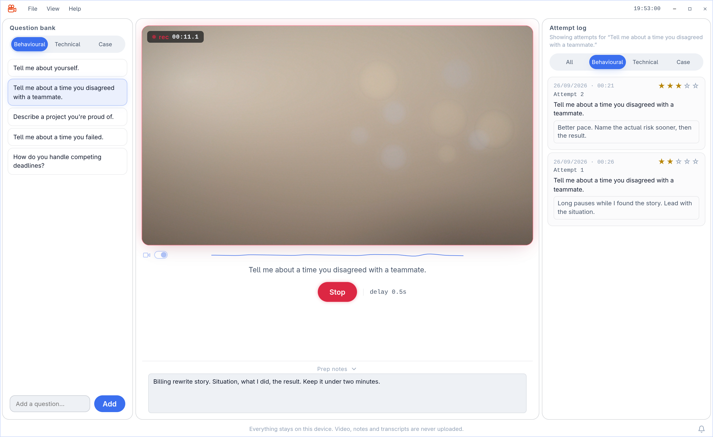
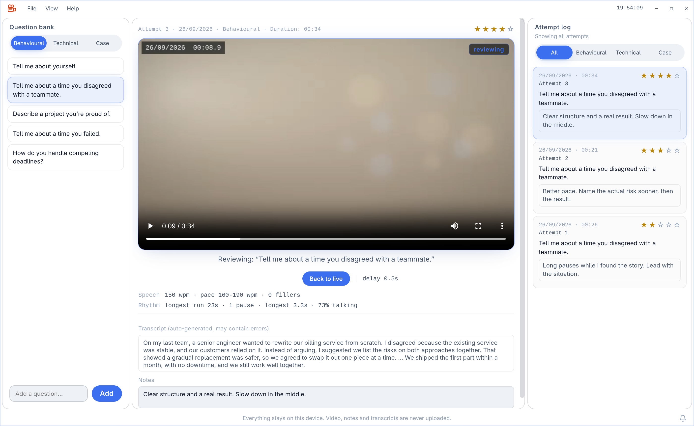

# Flight recorder

A local desktop app for practicing job interviews on webcam. Built with Tauri. Runs fully on your machine - no cloud storage of video or data, except for the optional, opt-in speech-pace (WPM) feature.

| Recording | Reviewing |
| --- | --- |
|  |  |

## Download

Grab the latest installer from the [Releases page](https://github.com/ei-sei/flight-recorder/releases/latest) - no build step needed.

- **Windows**: download `flight-recorder_<version>_x64-setup.exe` (or the `_x64_en-US.msi`), run it, then launch "Flight recorder" from the Start menu.
- **macOS**: download `flight-recorder_<version>_x64.dmg` (Intel) or `_aarch64.dmg` (Apple Silicon), open it, and drag the app into Applications.
- **Linux**: download whichever matches your distro - `.deb`, `.rpm` (e.g. Fedora), or `.AppImage` (works on most distros without installing anything).

> **Currently Windows-only.** Releases are temporarily built for Windows alone while active testing focuses there - see the commented-out matrix entries in `.github/workflows/release.yml` to re-enable macOS/Linux builds.

Once installed, updates are handled in-app: Help → Check for updates, or the bell icon in the bottom-right footer when one's available.

## Features

- **Question bank** organized by category (Behavioral, Technical, Case). Add and remove your own questions.
- **Webcam recorder** with a live viewfinder, record/stop tied to the selected question, and adjustable camera/microphone/quality (720p/1080p) in Settings.
- **Attempt log** - every recording is captured automatically with question, category, date, duration, and a per-question attempt number. Review any past attempt's video, rate it (1-5 stars), and add notes.
- **Filter tabs** over the attempt log (All / Behavioral / Technical / Case), and a per-question view when you select a question in the bank.
- **Response delay** - measures time from record start to first speech, using local mic-volume analysis. Fully local, works on every platform.
- **Speech pace (WPM)** - live words-per-minute estimate using the browser's built-in speech recognition. Off by default; see [Data & privacy](#data--privacy) below. Only available on Chromium-based webviews (Windows).
- **Light/dark theme**, a custom frameless window with its own titlebar and resize handles, and a File/View/Help menu bar.
- **Check for updates** (Help menu) checks the project's GitHub Releases for a newer version and can download, install, and restart into it.

## Tech stack

- **[Tauri](https://tauri.app)** (v2) - Rust backend, paired with each OS's native webview (WebView2 on Windows, WebKitGTK on Linux, WKWebView on macOS) instead of bundling Chromium, which keeps the install small.
- **Frontend**: plain HTML/CSS/JS - no React, Vue, or bundler. ES modules loaded directly by the webview.
- **Plugins**: `tauri-plugin-store` (question/attempt/settings persistence), `tauri-plugin-fs` (video files), `tauri-plugin-opener` (reveal-in-folder, external links), `tauri-plugin-window-state`, `tauri-plugin-updater` + `tauri-plugin-process` (auto-updates).
- Camera/mic capture and recording use standard `getUserMedia`/`MediaRecorder` Web APIs - no native plugin needed for that part.

## Project structure

```
flight-recorder/
├── src/                    Frontend (plain HTML/CSS/JS)
│   ├── index.html
│   ├── style.css
│   └── js/
│       ├── main.js          App init, menu bar, window controls, update bell
│       ├── recorder.js       Webcam capture, recording, live viewfinder
│       ├── attempts.js       Attempt log, video file I/O, orphaned-video recovery
│       ├── questions.js      Question bank CRUD
│       ├── store.js          tauri-plugin-store wrapper
│       ├── modal.js          Confirm/alert dialogs
│       ├── contextmenu.js    Custom right-click and menu-bar dropdowns
│       └── util.js           Formatting, slugify, filename helpers
├── src-tauri/              Rust backend
│   ├── src/
│   │   ├── lib.rs            Plugin registration, window icon, commands
│   │   └── main.rs
│   ├── capabilities/          Permission scoping (default.json)
│   ├── icons/                 App icon set for every platform
│   ├── Info.plist             macOS camera/mic usage descriptions
│   ├── build.rs                Embeds the git commit SHA at compile time
│   └── tauri.conf.json
├── screenshots/             Images used in this README
└── .github/
    ├── workflows/              CI, security scanning, release builds
    └── dependabot.yml
```

## Prerequisites

- **Rust** - install via [rustup](https://rustup.rs).
- **Node.js** (LTS) - for the Tauri CLI (`npm install`).
- **Platform system dependencies** (build-time on every OS; also a *runtime* dependency on Linux):
  - **Linux**: `libwebkit2gtk-4.1-dev`, `libgtk-3-dev`, `librsvg2-dev`, `patchelf`, `build-essential`, `libssl-dev`, `libayatana-appindicator3-dev`, `libsoup-3.0-dev`. On Debian/Ubuntu:
    ```
    sudo apt update && sudo apt install -y libwebkit2gtk-4.1-dev libgtk-3-dev librsvg2-dev patchelf build-essential curl wget file libssl-dev libayatana-appindicator3-dev libsoup-3.0-dev
    ```
    If you package as a `.deb`/`.rpm`, `libwebkit2gtk-4.1` is declared as a dependency so it installs automatically for end users. If you package as an AppImage, it does **not** bundle webkit2gtk - it must already be present on the target machine.
  - **Windows**: [WebView2](https://developer.microsoft.com/microsoft-edge/webview2/) (preinstalled on virtually all Windows 10/11 machines; Tauri's installer fetches it if missing) and the MSVC C++ build tools.
  - **macOS**: Xcode Command Line Tools (`xcode-select --install`). WKWebView is part of the OS. Camera/mic privacy usage descriptions are declared in `src-tauri/Info.plist` - required or `getUserMedia` fails outright in a packaged build. This hasn't been verified end-to-end on real macOS hardware yet.

## Develop

```
npm install
npm run tauri dev
```

Under WSL/WSLg, use `npm run dev:wsl` instead - it sets the software-rendering env vars WSLg needs to show a window at all.

## Build a release bundle

```
npm run tauri build
```

Produces a platform-native installer/bundle under `src-tauri/target/release/bundle/`.

## Releasing & auto-updates

Pushing a version tag (`git tag v0.1.0 && git push origin v0.1.0`) triggers `.github/workflows/release.yml`, which builds signed installers for Windows, macOS (Intel + Apple Silicon), and Linux via [tauri-action](https://github.com/tauri-apps/tauri-action), and publishes them as a **draft** GitHub Release along with a `latest.json` manifest.

You need to publish that draft manually (Releases → the draft → Publish) before it's live - this is intentional, so you can review the build first. Once published, the app's in-app updater (Help → Check for updates) polls `releases/latest/download/latest.json` on this repo and offers to download, install, and restart when a newer version is available.

Releases are signed with a minisign-style keypair (`tauri signer generate`); the public key lives in `src-tauri/tauri.conf.json`, and the private key is stored only as the `TAURI_SIGNING_PRIVATE_KEY` repo secret - never committed.

## CI & security

- **`.github/workflows/ci.yml`** - on every push/PR to `main`: `cargo fmt --check`, `cargo clippy -D warnings`, `cargo build`.
- **`.github/workflows/security.yml`** - `cargo audit` (RustSec advisories) and `npm audit`, on every push/PR plus a weekly schedule so newly-disclosed advisories against unchanged dependencies still get caught.
- **`.github/dependabot.yml`** - weekly automated update PRs for Cargo, npm, and GitHub Actions dependencies.

## Data & privacy

- **Video recordings** are written straight to disk under your OS "Videos" folder: `Videos/flight-recorder/{category}/{YYMMDD}-a{attempt number}-{question abbreviation}.webm` - e.g. `260901-a2-tmatydwt.webm` for the second attempt at "Tell me about a time you disagreed with a teammate." The extension follows whatever format the webview can actually record - `.webm` (VP8/VP9+Opus) normally, falling back to `.mp4` (H.264) on webviews that don't support recording WebM (notably Safari/WKWebView). Nothing about video ever leaves the machine.
- **Metadata** - the question bank, and each attempt's question/category/date/duration/score/notes/response-delay - is persisted locally via `tauri-plugin-store`, a JSON file in the app's local data directory.
- **Speech pace (WPM)** is the one feature that isn't fully local. It's **off by default**. When you explicitly turn it on, live audio is sent to the webview's built-in speech recognition (Google's servers, on Chromium-based webviews) while recording, to estimate words-per-minute. It's only available on Chromium-based webviews (in practice: Windows/WebView2) - WebKitGTK (Linux) and WKWebView (macOS) don't implement the Web Speech API, so the toggle is disabled there.
- Deleting an attempt removes both its metadata entry and its video file from disk.
- Deleting a question also deletes every attempt (and video file) recorded under it - the confirmation prompt tells you how many before you commit.

## Design language

Dark, sleek, flat editor-style chrome: panels are tightly packed with a small gap and each has its own complete hairline border (no shared dividers, no rounded corners, no drop shadows), with a permanent left activity rail selecting sidebar content. Blue/indigo as the primary accent, red for recording/destructive actions, gold for star ratings, segmented pill-style filter tabs as the one deliberately rounded control, monospace timers and numeric readouts, sentence-case labels, compact/efficient spacing.

## Acknowledgments

Built with [Claude Code](https://claude.com/claude-code)'s assistance.
